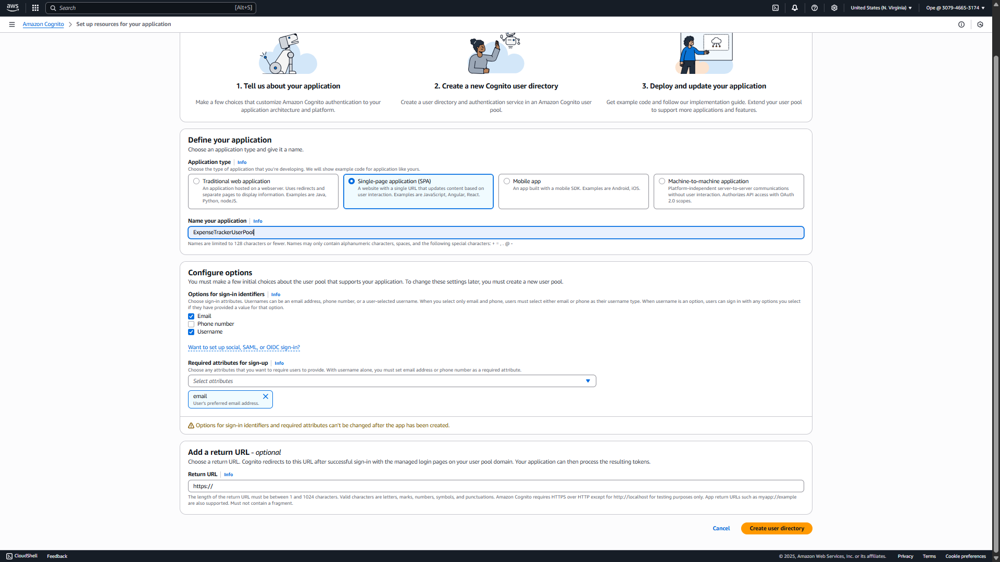
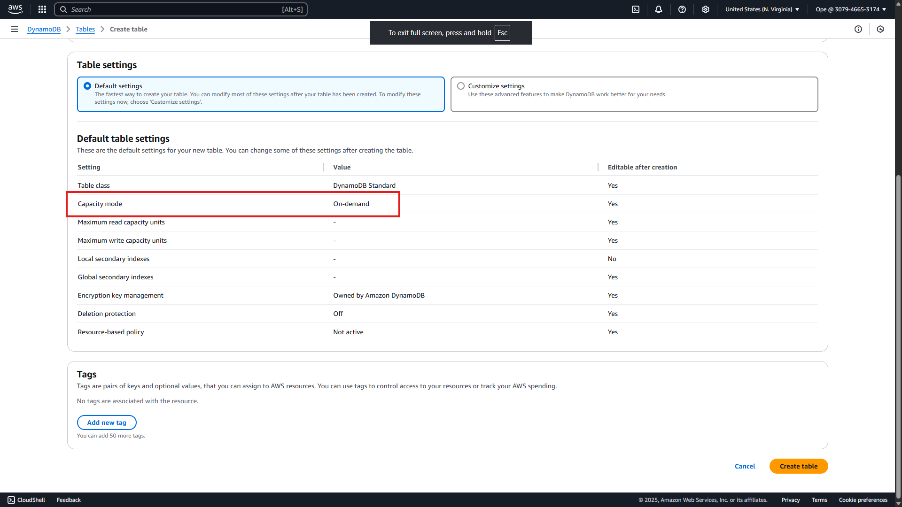
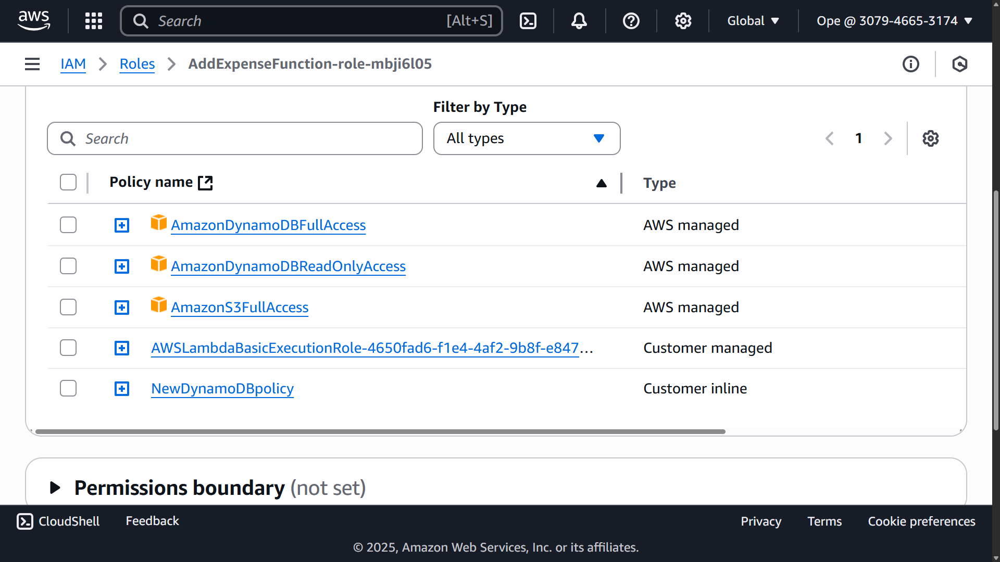
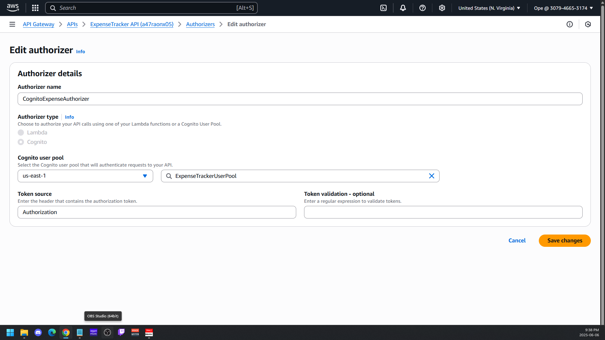

# 📗 Project Guide: Serverless Expense Tracker (AWS)

---

## 📝 Description

This guide walks you through building a **Serverless Expense Tracker** using AWS services. You’ll create:

- A **Cognito User Pool** for authentication.
- A **DynamoDB** table to store expenses.
- Two **Lambda functions** (`AddExpenseFunction` and `GetExpenseFunction`) in Python.
- A **REST API** via **API Gateway** secured by Cognito.
- A static **HTML/JavaScript** frontend (`login.html` and `tracker.html`) hosted on S3 + CloudFront.
- An **S3 bucket** to store each expense as JSON files.
- An **Amazon QuickSight** dataset for visualizing expense data from S3.

Along the way, you’ll see common pitfalls—data type mismatches, CORS misconfigurations, IAM permission errors, and integration mistakes—and learn how to troubleshoot them. Wherever a visual check is useful, you’ll find a placeholder to insert screenshots or console logs.

---

## 📑 Table of Contents

1. [Introduction](#introduction)  
2. [Service Selection & Motivation](#service-selection--motivation)  
   - Why These Services?  
   - Key Points & Justifications  
3. [Prerequisites](#prerequisites)  
4. [Step-by-Step Build Process](#step-by-step-build-process)  
   1. [Create the Cognito User Pool](#1-create-the-cognito-user-pool)  
   2. [Create the DynamoDB Table](#2-create-the-dynamodb-table)  
   3. [Develop & Deploy `AddExpenseFunction`](#3-develop--deploy-addexpensefunction)  
      - Initial Implementation  
      - Saving to S3  
      - Granting IAM Permissions  
      - Testing & Debugging  
   4. [Develop & Deploy `GetExpenseFunction`](#4-develop--deploy-getexpensefunction)  
      - Initial Implementation  
      - Handling Decimal and CORS  
   5. [Create & Configure API Gateway](#5-create--configure-api-gateway)  
      - REST API Design  
      - Cognito Authorizer  
      - CORS Configuration  
      - Deployment  
   6. [Build & Host Frontend (login.html & tracker.html)](#6-build--host-frontend)  
      - User Authentication Flow  
      - Add Expense & Get Expense Logic  
      - CloudFront + S3 Setup  
      - Common Frontend Mistakes  
   7. [Store Expense Data in S3](#7-store-expense-data-in-s3)  
      - Lambda Code for S3 Upload  
      - IAM Role Updates  
      - Verifying S3 Writes  
   8. [Connect Amazon QuickSight](#8-connect-amazon-quicksight)  
      - Grant QuickSight S3 Access  
      - Create Manifest File  
      - Import & Visualize Data  
   9. [Common Mistakes & Checks](#9-common-mistakes--checks)  
5. [Image Placeholders](#image-placeholders)  
6. [Conclusion](#conclusion)  

---

## 📖 Introduction

This project demonstrates how to build a fully serverless expense tracker on AWS. The architecture includes:

1. **User Authentication** via Amazon Cognito User Pool.  
2. **Expense Storage** in DynamoDB (table “Expenses”).  
3. **Lambda Functions** for adding and retrieving expenses.  
4. **REST API** endpoints (POST/GET) in API Gateway, secured by Cognito.  
5. **Frontend** pages (`login.html`, `tracker.html`) hosted on S3 + CloudFront.  
6. **Data Lake** in S3, storing each expense as a JSON file (`expenses/<userId>/<timestamp>_<UUID>.json`).  
7. **Analytics & Visualization** in Amazon QuickSight, reading from S3 via a manifest.

By the end, you will have a working, secure, and scalable expense tracker with analytics capabilities.

---

## ⚙️ Service Selection & Motivation

### Why These Services?

- **Amazon Cognito (User Pool)**  
  - ✅ *Managed user directory* for signup, sign-in, and JWT issuance.  
  - ✅ *Built-in verification* (email code).  
  - ✅ *Integrates seamlessly* with API Gateway Authorizer.

- **Amazon DynamoDB**  
  - ✅ *Fully managed NoSQL* that scales automatically.  
  - ✅ *On-demand capacity* keeps you within the AWS Free Tier.  
  - ✅ *Flexible schema* fits expense items (userId, timestamp, amount, category, description).

- **AWS Lambda**  
  - ✅ *Serverless compute*—only pay per execution.  
  - ✅ *Easy integration* with DynamoDB and S3.

- **Amazon API Gateway**  
  - ✅ *REST endpoints* exposing Lambda functions.  
  - ✅ *Cognito Authorizer* enforces authentication.  
  - ✅ *Built-in CORS* support.

- **Amazon S3**  
  - ✅ *Serverless data lake* to store raw expense JSON files.  
  - ✅ *Cheap, durable storage* for analytics.

- **Amazon QuickSight**  
  - ✅ *Self-service BI* reading from S3 via manifest.  
  - ✅ *Fast insights* into spending patterns across users and categories.

- **CloudFront + S3 (Static Hosting)**  
  - ✅ *Global CDN* for low-latency frontend access.  
  - ✅ *TLS encryption* for your HTML/JS files.

### Key Points & Justifications

- **Security & Scalability**  
  - Cognito & API Gateway Authorizer ensure only authenticated users interact with the API.  
  - DynamoDB on-demand capacity and S3 storage scale automatically.

- **Separation of Concerns**  
  - Lambda functions handle business logic (add, get expenses).  
  - S3 acts as an immutable audit/data lake for analytics.  
  - QuickSight is purely for visualization—no direct database load.

- **Cost Efficiency**  
  - All services remain in the Free Tier with low traffic—DynamoDB on-demand, Lambda per 1M requests, S3 storage minimal.

---

## 📋 Prerequisites

- **AWS Account** with full permissions to Cognito, DynamoDB, Lambda, API Gateway, S3, QuickSight.  
- **AWS CLI** configured (optional, for deployments).  
- **Python 3.x** for editing/testing Lambda code.  
- **Postman** or **curl** for API testing.  
- **Text Editor** (VS Code, Sublime).  
- **Basic knowledge** of JavaScript/HTML for frontend.

---

## 🛠 Step-by-Step Build Process

### 1. Create the Cognito User Pool

#### Steps:

1. Open the **Amazon Cognito Console** → **Manage User Pools** → **Create a user pool**.  
2. **Name**: `ExpenseTrackerUserPool`  
3. Under **Attributes**, ensure:
   - **Username** (alias)  
   - **Email** (required, used for verification)  
4. Under **Policies**, set **Password policy**:
   - Minimum length: **6**  
   - Require at least one number, one special character, one uppercase, one lowercase.  
5. Under **App clients**, click **Add an app client**:
   - **Name**: `ExpenseTrackerApp`  
   - **Generate client secret**: Unchecked  
   - Click **Create app client** → note the **App client ID** (`<COGNITO_APP_CLIENT_ID>`).  
6. Under **App client settings**, enable **Cognito User Pool** as provider, set callback/redirect URLs temporarily to `http://localhost`.  
7. Click **Create pool** → note the **Pool ID** at the top (`<COGNITO_USER_POOL_ID>`).

> **Common Mistake #1**: Forgetting to configure email verification → users cannot complete sign-up.  
> **Check**: Under **Messages** → **Verification** tab, ensure email verification is enabled.



---

### 2. Create the DynamoDB Table

#### Steps:

1. Open the **DynamoDB Console** → Click **Create table**.  
2. **Table name**: `Expenses`  
3. **Partition key**: `userId` (String)  
4. **Sort key**: `timestamp` (String)  
5. **Capacity mode**: **On-demand**  
6. Leave all other settings as default → Click **Create**.

> **Common Mistake #2**: Not choosing On-demand capacity → leads to provisioning hassles.  
> **Check**: In the table’s **Capacity** tab, verify “On-demand” is selected.



---

### 3. Develop & Deploy `AddExpenseFunction`

#### 3.1 Initial Implementation

Create a new Lambda function:

1. Open the **Lambda Console** → **Create function**.  
2. **Function name**: `AddExpenseFunction`  
3. **Runtime**: Python 3.12  
4. **Execution role**: Create a new role with basic Lambda permissions.  
5. Click **Create function**.

In the code editor, replace with:

```python
import json
import boto3
from datetime import datetime
from decimal import Decimal
import uuid

dynamodb = boto3.resource('dynamodb')
table = dynamodb.Table('Expenses')
s3 = boto3.client('s3')
BUCKET_NAME = 'expense-tracker-data-ope'

def lambda_handler(event, context):
    print("Received event:", event)

    try:
        body = json.loads(event.get('body', '{}'))
        user_id = body.get('userId')
        amount = body.get('amount')
        category = body.get('category')

        if not user_id or amount is None or not category:
            return {
                'statusCode': 400,
                'headers': {
                    'Content-Type': 'application/json',
                    'Access-Control-Allow-Origin': '*'
                },
                'body': json.dumps({'error': 'Missing required fields: userId, amount, or category'})
            }

        amount = Decimal(str(amount))
        description = body.get('description', '')
        timestamp = datetime.utcnow().isoformat()

        # DynamoDB item
        item = {
            'userId': user_id,
            'timestamp': timestamp,
            'amount': amount,
            'category': category,
            'description': description
        }

        # 1. Save to DynamoDB
        table.put_item(Item=item)

        # 2. Save to S3 as JSON file
        unique_id = str(uuid.uuid4())
        s3_key = f"expenses/{user_id}/{timestamp}_{unique_id}.json"
        s3.put_object(
            Bucket=BUCKET_NAME,
            Key=s3_key,
            Body=json.dumps(item, default=str),
            ContentType='application/json'
        )

        return {
            'statusCode': 200,
            'headers': {
                'Content-Type': 'application/json',
                'Access-Control-Allow-Origin': '*'
            },
            'body': json.dumps({'message': 'Expense added successfully'})
        }

    except Exception as e:
        print("Error occurred:", str(e))
        return {
            'statusCode': 500,
            'headers': {
                'Content-Type': 'application/json',
                'Access-Control-Allow-Origin': '*'
            },
            'body': json.dumps({'error': 'Internal server error', 'details': str(e)})
        }
````

> **Common Mistake #3**: Not converting `amount` to `decimal.Decimal` → DynamoDB rejects non-Decimal values.
> **Check**: In CloudWatch Logs, look for `ValidationException` related to number format.

#### 3.2 Granting IAM Permissions

1. In the Lambda Console, click **Configuration** → **Permissions** → click the **Execution Role**.
2. In IAM, under **Permissions** tab, click **Add inline policy** → JSON → paste:

```json
{
  "Version": "2012-10-17",
  "Statement": [
    {
      "Effect": "Allow",
      "Action": [
        "dynamodb:PutItem",
        "dynamodb:Query"
      ],
      "Resource": "arn:aws:dynamodb:us-east-1:<your-account-id>:table/Expenses"
    },
    {
      "Effect": "Allow",
      "Action": [
        "s3:PutObject"
      ],
      "Resource": "arn:aws:s3:::expense-tracker-data-user/expenses/*"
    }
  ]
}
```

3. Click **Review policy** → Name it `ExpenseTrackerLambdaPolicy` → **Create policy**.

> **Check**: Verify the role now lists DynamoDB and S3 permissions under **Permissions**.



#### 3.3 Testing & Debugging

1. In Lambda Console, click **Test** → Create a new test event:

   ```json
   {
     "body": "{\"userId\":\"user1\",\"amount\":\"30.5\",\"category\":\"Food\",\"description\":\"Coffee\"}"
   }
   ```
2. Click **Test**.
3. If successful, inspect S3 bucket: you should see an object under `expenses/user1/` with name `<timestamp>_<UUID>.json`.
4. If error:

   * Check CloudWatch Logs for exceptions.
   * Common issue: bucket name typo or missing IAM permissions.

---

### 4. Develop & Deploy `GetExpenseFunction`

#### 4.1 Initial Implementation

Create a new Lambda function:

1. **Function name**: `GetExpenseFunction`
2. **Runtime**: Python 3.12
3. **Execution role**: Attach the same role as `AddExpenseFunction` (or ensure it has DynamoDB `Query` permission).

Replace code with:

```python
import json
import boto3
from decimal import Decimal
from boto3.dynamodb.conditions import Key

dynamodb = boto3.resource('dynamodb')
table = dynamodb.Table('Expenses')

class DecimalEncoder(json.JSONEncoder):
    def default(self, obj):
        if isinstance(obj, Decimal):
            return float(obj)
        return super().default(obj)

def lambda_handler(event, context):
    print("Received event:", event)

    try:
        params = event.get('queryStringParameters') or {}
        user_id = params.get('userId')
        if not user_id:
            return {
                'statusCode': 400,
                'headers': {
                    'Content-Type': 'application/json',
                    'Access-Control-Allow-Origin': '*'
                },
                'body': json.dumps({'error': "Missing 'userId' query parameter"})
            }

        response = table.query(
            KeyConditionExpression=Key('userId').eq(user_id),
            ScanIndexForward=False  # Latest first
        )
        items = response.get('Items', [])

        return {
            'statusCode': 200,
            'headers': {
                'Content-Type': 'application/json',
                'Access-Control-Allow-Origin': '*'
            },
            'body': json.dumps({'expenses': items}, cls=DecimalEncoder)
        }
    except Exception as e:
        print("Error:", str(e))
        return {
            'statusCode': 500,
            'headers': {
                'Content-Type': 'application/json',
                'Access-Control-Allow-Origin': '*'
            },
            'body': json.dumps({'error': 'Internal server error', 'details': str(e)})
        }
```

> **Common Mistake #4**: Not serializing `Decimal` objects → causes `TypeError` in `json.dumps`.
> **Check**: Query the Lambda with `{"queryStringParameters": {"userId": "user1"}}` and ensure JSON is returned.

---

### 5. Create & Configure API Gateway

#### 5.1 REST API Design

1. Open **API Gateway Console** → **Create API** → **REST API (not private)**.
2. **API name**: `ExpenseTrackerAPI`.
3. Under **Resources**, click **Actions** → **Create Resource**:

   * **Resource Name**: `expenses`
   * **Resource Path**: `/expenses`
4. With `/expenses` selected, click **Actions** → **Create Method** → **POST**:

   * Integration type: **Lambda Function** → choose `AddExpenseFunction`
   * Check **Use Lambda Proxy integration**
5. Again, under `/expenses` → **Create Method** → **GET**:

   * Integration type: **Lambda Function** → choose `GetExpenseFunction`
   * Check **Use Lambda Proxy integration**

> **Common Mistake #5**: Forgetting Lambda Proxy → query parameters not passed correctly. Always enable it.

#### 5.2 Cognito Authorizer

1. In the left menu, click **Authorizers** → **Create New Authorizer**:

   * **Name**: `CognitoAuthorizer`
   * **Type**: `Cognito`
   * **Cognito User Pool**: `<COGNITO_USER_POOL_ID>`
   * **Token Source**: `Authorization`
2. Go back to `/expenses` → **POST** → **Method Request** → **Authorization**: select `CognitoAuthorizer`.
3. Do the same for **GET** method.

> **Check**: Ensure both methods show “Authorization: CognitoAuthorizer” under **Method Request**.



#### 5.3 CORS Configuration

1. Select `/expenses` → **Actions** → **Enable CORS**.

   * Add `Access-Control-Allow-Headers: Content-Type,Authorization`
   * Add `Access-Control-Allow-Methods: GET,POST,OPTIONS`
   * Add `Access-Control-Allow-Origin: '*'`
2. Confirm and let API Gateway create an **OPTIONS** method.
3. For each method (POST/GET), confirm under **Integration Response (200)** → **Header Mappings** includes `Access-Control-Allow-Origin: '*'`.

> **Common Mistake #6**: Skipping the OPTIONS method. Without it, browsers block POST/GET due to missing preflight response.

#### 5.4 Deploy API

1. Click **Actions** → **Deploy API**.
2. **Deployment stage**: Create a new stage named `prod`.
3. Note the **Invoke URL**, e.g.:

   ```
   https://<YOUR_API_ID>.execute-api.<region>.amazonaws.com/prod/expenses
   ```

> **Image Placeholder:**
> ``

---

### 6. Build & Host Frontend (login.html & tracker.html)

#### 6.1 User Authentication Flow

1. **login.html** includes the Cognito JS SDK (`amazon-cognito-identity-js@5.2.4`).
2. **Sign-Up Section** (hidden behind a “Create Account” toggle by default):

   * Fields: `Username`, `Email`, `Password`
   * Password requirements shown:

     ```
     • At least 6 characters  
     • Contains at least 1 number  
     • Contains at least 1 special character  
     • Contains at least 1 uppercase  
     • Contains at least 1 lowercase
     ```
   * Calls `userPool.signUp(username, password, [emailAttribute], ...)`.
   * On success, display “Confirm Account” section (Username + Verification Code).
   * `btnConfirmCode` calls `CognitoUser.confirmRegistration(code, ...)`.
   * `btnResendCode` calls `CognitoUser.resendConfirmationCode(...)`.
3. **Sign-In Section** (default visible):

   * Fields: `Username`, `Password`
   * Calls `CognitoUser.authenticateUser(...)`.
   * On success: store `idToken` and `signinUsername` in `sessionStorage`, redirect → `tracker.html`.

> **Common Mistake #7**: Forgetting to include the Cognito JS SDK script or using the wrong version.
> **Check**: Browser console should show `AmazonCognitoIdentity` defined.

#### 6.2 Add Expense & Get Expense Logic (tracker.html)

1. On page load:

   * Check `sessionStorage.getItem('idToken')`. If missing, redirect → `login.html`.
   * Auto-fill `userIdAdd` and `userIdGet` inputs with `signinUsername` (editable for sub-accounts).
2. **Sign Out Button**

   * Calls `CognitoUser.signOut()`, clears `sessionStorage`, redirects → `login.html`.
3. **`addExpense()`**:

   ```js
   const token = sessionStorage.getItem('idToken');
   const payload = { userId, amount, category, description };
   fetch(apiUrl, {
     method: 'POST',
     headers: {
       'Content-Type': 'application/json',
       'Authorization': token
     },
     body: JSON.stringify(payload)
   });
   ```

   * On success: clear fields, show alert.
   * On failure: show error (either `result.error` or HTTP status).
4. **`getExpenses()`**:

   ```js
   const token = sessionStorage.getItem('idToken');
   fetch(`${apiUrl}?userId=${encodeURIComponent(userId)}`, {
     method: 'GET',
     headers: { 'Authorization': token }
   });
   ```

   * Display list of expenses (timestamp, category, amount, description).
   * Handle `No expenses found` or errors.

> **Common Mistake #8**: Hardcoding `userId` as read-only; remove `readonly` to allow multiple sub-account IDs.
> **Common Mistake #9**: Missing `Authorization` header in fetch → results in 401 Unauthorized.

#### 6.3 CloudFront + S3 Setup

1. **Create S3 Bucket** for frontend: e.g., `expense-tracker-frontend-ope`.

   * Upload `login.html`, `tracker.html`, CSS, JS files.
   * Set bucket policy or object ACLs to allow public reads.
2. **Create CloudFront Distribution**:

   * **Origin**: S3 bucket.
   * **Default behavior**: GET/HEAD from S3.
   * **Cache Policy**: for HTML, add `Cache-Control: no-cache, max-age=0` in metadata.
3. **Invalidations**: After every frontend update, invalidate `/login.html` and `/tracker.html`.

> **Image Placeholder:**
> ``

---

### 7. Store Expense Data in S3

#### 7.1 Lambda Code for S3 Upload

(Already implemented in **AddExpenseFunction** above.)
Each expense is saved to:

```
s3://expense-tracker-data-ope/expenses/{userId}/{timestamp}_{UUID}.json
```

#### 7.2 Verify S3 Writes

1. Add an expense via `tracker.html`.
2. Go to **S3 Console** → **expense-tracker-data-ope** → **expenses/\`**.
3. You should see a folder for your `userId` containing one or more `.json` files.
4. Open a JSON file in the S3 console to confirm its contents.

> **Common Mistake #10**: Bucket policy not permitting `s3:PutObject`.
> **Check**: After adding, if no file appears, check CloudWatch Logs for “AccessDenied”.


---

### 8. Connect Amazon QuickSight

#### 8.1 Grant QuickSight S3 Access

1. Open **QuickSight Console** → click profile → **Manage QuickSight**.
2. Go to **Security & permissions**.
3. Under **Amazon S3** → **Add or remove** → check **expense-tracker-data-user**. → **Finish**.

> **Check**: If bucket doesn’t appear, confirm QuickSight is in the same AWS account/region.

#### 8.2 Create `manifest.json`

To import **all JSON files** under `expenses/`, use:

```json
{
  "fileLocations": [
    {
      "URIPrefixes": [
        "s3://expense-tracker-data-user/expenses/"
      ]
    }
  ],
  "globalUploadSettings": {
    "format": "JSON",
    "containsHeader": "false"
  }
}
```

1. Save as `manifest.json`.
2. Upload to the root: `s3://expense-tracker-data-user/manifest.json`.

> **Common Mistake #11**: Manifest pointing to root when files are under `expenses/`.
> **Check**: In S3, ensure `manifest.json` and `expenses/` are siblings.

#### 8.3 Import into QuickSight

1. In QuickSight, go to **Datasets** → **New dataset** → **S3**.
2. Enter manifest file path:

   ```
   s3://expense-tracker-data-user/manifest.json
   ```
3. Click **Connect** → QuickSight will crawl all JSON files.
4. Create an analysis: choose fields `userId`, `timestamp`, `amount`, `category`, `description`.

> **Image Placeholder:**
> ``

#### 8.4 Build Visualizations

* **Bar Chart**: Sum of `amount` by `category`.
* **Line Chart**: Time-series of monthly total spend.
* **Table/Filter**: Filter by `userId` to compare users.

> **Image Placeholder:**
> ``

---

## ⚠️ Common Mistakes & Checks

1. **Cognito Password Policy Misalignment**

   * Mistake: Frontend not validating password to match Cognito rules (6+ chars, uppercase, lowercase, number, special).
   * Check: Attempt sign-up with invalid password → should see Cognito error message.

2. **Authorization Token Mismatch**

   * Mistake: API Gateway Authorizer tied to wrong User Pool.
   * Check: In API Gateway → Authorizers → ensure pool ID = `<COGNITO_USER_POOL_ID>`.

3. **Missing CORS Headers**

   * Mistake: Browser console shows `Access to fetch at ... has been blocked by CORS policy`.
   * Check: In API Gateway → Integration Response → add `Access-Control-Allow-Origin: '*'`.

4. **Decimal vs. Float in DynamoDB**

   * Mistake: Using Python `float`—DynamoDB expects `Decimal`.
   * Check: CloudWatch Logs show `ValidationException`.

5. **S3 Bucket Policy for QuickSight**

   * Mistake: QuickSight cannot see files → “can’t find any configurations.”
   * Check: Use bucket policy allowing `quicksight.amazonaws.com` to `s3:GetObject` and `s3:ListBucket`.

6. **Manifest File Path Errors**

   * Mistake: Manifest references wrong prefix (`user1/` instead of `expenses/`).
   * Check: QuickSight import error indicates missing files—verify `URIPrefixes` or `URIs`.

7. **CloudFront Cache Not Invalidated**

   * Mistake: After updating `tracker.html`, old version still loads.
   * Check: In CloudFront → Invalidations → create invalidation for `/login.html`, `/tracker.html`.

---

## 📸 Image Placeholders

* ``
* ``
* ``
* ``
* ``
* ``
* ``
* ``
* ``

*(Replace `assets/...` with your actual screenshot paths.)*

---

## 🏁 Conclusion

You’ve built a **fully serverless expense tracker**:

* **Cognito** for secure user authentication.
* **DynamoDB** for fast, scalable storage of expense items.
* **Lambda** for compute logic (add & get expenses).
* **API Gateway** to expose REST endpoints, secured by Cognito.
* **S3** as a data lake for expense JSON files.
* **CloudFront + S3** to host and deliver the static frontend.
* **QuickSight** for analytics and visualization of expense data across all users.

Feel free to extend this foundation with features like:

* **Pagination** and **filters** in `GetExpenseFunction`.
* **AWS CDK/SAM** for full infrastructure-as-code.
* **Custom domain** and HTTPS certificate in CloudFront.
* **Server-side validation**, enhanced error handling, or multi-tenant separation.

Happy building and analyzing your expenses!

```
