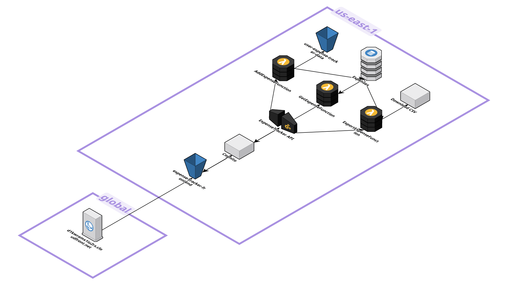
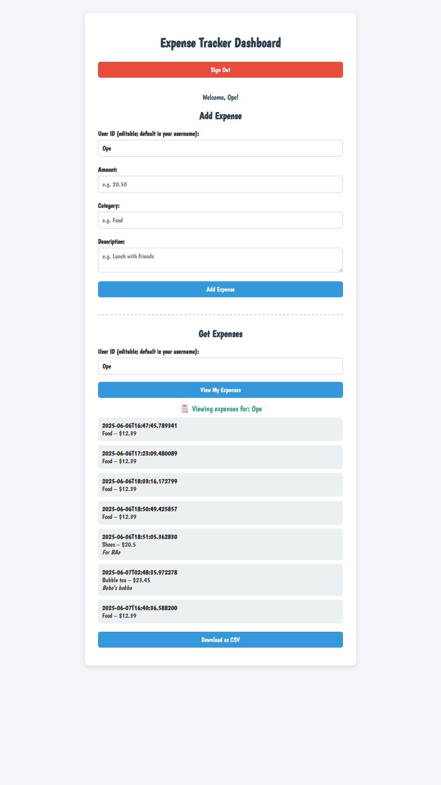

# 💎 Advanced Expense Tracker

A multi-user, serverless expense tracker built using AWS services. Users can sign up, sign in, and manage personal expenses with receipt uploads and analytics dashboards. This project extends the foundational serverless architecture by adding authentication, S3 storage, CloudFront delivery, and QuickSight insights.

---

## 🛠 Tech Stack

- ☁️ **AWS Lambda**  
- 🌐 **Amazon API Gateway**  
- 📦 **Amazon DynamoDB**  
- 🛡️ **Amazon Cognito**  
- ☁️ **Amazon S3**  
- 🌍 **Amazon CloudFront**  
- 📊 **Amazon QuickSight (Optional)**  
- 🖥️ **HTML / JavaScript** (frontend)  
- 🐍 **Python** (Lambda functions)  

*Tip: Each item above reflects a core technology used. Feel free to extend as your project evolves!*

---

## 🚀 Features

- Built using AWS services within the Free Tier (Lambda, API Gateway, DynamoDB).  
- Lambda functions add, retrieve, and export expense data per user.  
- Secure multi-user authentication via Amazon Cognito.  
- Receipt image upload and storage in an S3 bucket.  
- Hosted frontend assets on CloudFront for low-latency global delivery.  

---

## 🏗️ Project Architecture
This project follows a serverless architecture using AWS managed services for scalability and cost-efficiency.


---

## 🌐 Live Demo
Try it here: [Expense Tracker Web App](https://d1kwramx1iu2rs.cloudfront.net/)

---

## 📂 Project Structure

```
advanced-expense-tracker/
│
├── assets/
│   ├── api-gateway-authorizer.png
│   ├── cognito-user-pool.png
│   ├── dynamodb-table.png
│   ├── lambda-iam-policy.png
│   └── tracker-screenshot-placeholder.png
│
├── backend/
│ ├── AddExpenseFunction.py # Lambda to add a new expense and save to S3
│ ├── GetExpenseFunction.py # Lambda to retrieve expenses from DynamoDB
│ └── ExportExpenseFunction.py # Lambda to export expenses as CSV
│
├── frontend/
│ ├── login.html # Login / Sign-Up page using Cognito
│ └── tracker.html # Dashboard page to add/view expenses
│
├── infrastructure/
│ └── ExpenseTracker_API-prod-oas30.yaml # Exported API Gateway OpenAPI YAML
│
└── README.md # Project overview and instructions

```

---

## ☁️ Infrastructure

- The `infrastructure/ExpenseTracker_API-prod-oas30.yaml` file contains the exported OpenAPI (YAML) configuration for API Gateway. Import this into any AWS account/region to recreate the same endpoints.  
- Amazon Cognito User Pool and App Client handle sign-up, sign-in, and JWT issuance.  
- An S3 bucket (e.g., `expense-tracker-data-ope`) stores JSON expense files and uploaded receipt images.  
- CloudFront distribution serves static frontend assets from S3 with HTTPS and caching.

---

## 🚀 How to Run & Deploy

### 🖥️ Local Testing

1. Open `frontend/login.html` in a modern browser.  
2. Sign up or sign in using an existing Cognito user.  
3. Upon successful login, you will be redirected to `tracker.html`.  
4. On `tracker.html`, enter **User ID**, **Amount**, **Category**, and **Description**, then click **Add Expense**.  
5. Click **View My Expenses** to fetch all items for the provided user ID.

> **Note:** For local testing without AWS resources, some buttons will not work. You can still confirm UI layout and form validation.

---

### 🛠️ Deploy Backend

1. **Create DynamoDB Tables**  
   - Table name: `Expenses`  
   - Partition key: `userId` (String)  
   - Sort key: `timestamp` (String)  

2. **Set Up Amazon Cognito**  
   - Create a **User Pool** and configure required attributes (e.g., email).  
   - Create an **App Client** (no secret) and note the **User Pool ID** and **App Client ID**.  
   - In Lambda functions, update code to extract `userId` from JWT token.  

3. **Deploy Lambda Functions**  
   - Create `AddExpenseFunction` (runtime: Python 3.x) and upload `backend/AddExpenseFunction.py`.  
   - Create `GetExpenseFunction` (runtime: Python 3.x) and upload `backend/GetExpenseFunction.py`.  
   - Create `ExportExpenseFunction` (runtime: Python 3.x) and upload `backend/ExportExpenseFunction.py`.  
   - Attach IAM roles/policies granting each function access only to necessary resources:  
     - `AddExpenseFunction`: write to DynamoDB `Expenses` table and put objects into S3 bucket.  
     - `GetExpenseFunction`: read from DynamoDB `Expenses` table.  
     - `ExportExpenseFunction`: read from DynamoDB `Expenses` table.  

4. **Configure API Gateway**  
   - Create a new REST API and import `infrastructure/ExpenseTracker_API-prod-oas30.yaml`.  
   - Enable CORS on each method (`POST /expenses`, `GET /expenses`, `GET /export-expenses`).  
   - Configure **Authorization** to use Cognito’s JWT authorizer for endpoints that require authentication.  
   - Deploy the API to a stage (e.g., `prod`) and note the **Invoke URL**.  

5. **Create and Configure S3 Bucket**  
   - Create an S3 bucket (e.g., `expense-tracker-data-user`).  
   - Enable public read access only for static assets if hosting frontend here.  
   - Configure bucket policy to allow Lambda to put objects.  

6. **Set Up CloudFront**  
   - Create a CloudFront distribution pointing to the S3 bucket (static website endpoint or Origin Access Identity).  
   - Configure caching policies, HTTPS, and custom domain if desired.  
   - Update `login.html` and `tracker.html` to reference the API’s Invoke URL and Cognito region/IDs.  

7. **Configure QuickSight (Optional)**  
   - In QuickSight, create a new dataset from S3. Point to the bucket or prefix containing JSON expense files.  
   - Build dashboards showing spending trends, category breakdowns, and CSV exports.  

---

## 💡 Host Frontend

1. Upload `login.html` and `tracker.html` to your S3 bucket under a folder (e.g., `public/`).  
2. If using CloudFront, set the bucket’s **static website hosting** or configure an Origin Path to serve these HTML files.  
3. Ensure CORS settings on S3 allow your API’s domain to be called from these pages.  
4. Update the JavaScript in both HTML files to point `fetch` calls to your API Gateway Invoke URL.  

---

### 🧪 Local UI Preview

Here’s a snapshot of the Tracker Dashboard when viewing expenses:



---

## 📬 Contact

Ope – Aspiring Cloud Support Specialist  
[LinkedIn](https://linkedin.com/in/oshinyemio) | [oshinyemio@gmail.com](mailto:oshinyemio@gmail.com)

---

## 📜 License

This project is licensed under the MIT License.
